# Agentic Log Analysis System — Full System Integration

A complete trace of how every component integrates: FNOL, Customer Portal, Agent Portal, Shared Data API, Agentic Dashboard, Agitator, Databases, Chroma Vector Store, and Ollama (local AI per [ADR-017](../decisions/ADR-017-local-ai-via-ollama.md) — Phase 8; replaces the prior OpenAI dependency). *Phase 8 implementation lands in PR 8b.*

---

## The Data Layer

Everything starts with two databases, both owned exclusively by the Shared Data API:

**PostgreSQL** holds `claims` and `claim_status_history` — the transactional insurance data. FNOL creates claims, the background simulator advances their statuses, and Agent Portal reads them.

**MongoDB** holds `users` and `policies` (with embedded vehicles) — the customer/policy data. All three insurance apps read from it. Customer Portal is the primary consumer.

No other app has a database driver or connection. Every data operation in the system flows through the SDA over HTTP.

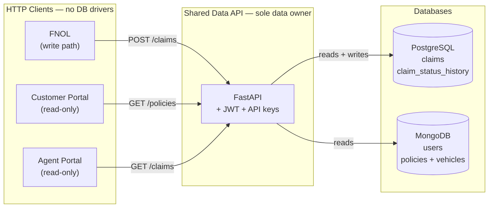

---

## Auth — Two Independent Systems

**System 1: SDA-issued JWT** — FNOL, Customer Portal, and Agent Portal all authenticate end users the same way. The user's browser hits the app's login form, the app proxies `POST /auth/login` to the SDA, the SDA validates credentials against MongoDB's `users` collection, and returns a JWT (HS256, shared `JWT_SECRET`, 60-minute expiry, claims: `user_id`, `role`, `app`). Every subsequent request from that app to the SDA carries that JWT plus an `X-API-Key` header identifying which app is calling (`SHARED_DATA_API_KEY_FNOL`, `_CUSTOMER_PORTAL`, `_AGENT_PORTAL`). The SDA logs both: `caller=fnol user=USR-001`.

**System 2: Standalone Dashboard JWT** — the dashboard authenticates with its own `DASHBOARD_JWT_SECRET` and env-supplied admin credentials. It never talks to the SDA for auth. This is deliberate: when the insurance apps are sick (which is exactly when you need the dashboard), the dashboard's auth still works.

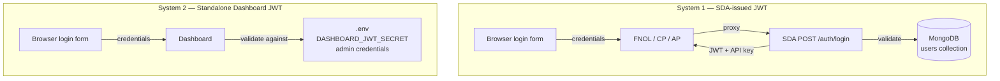

---

## Request Flows — The Three Insurance Apps

### FNOL (the sole write path)

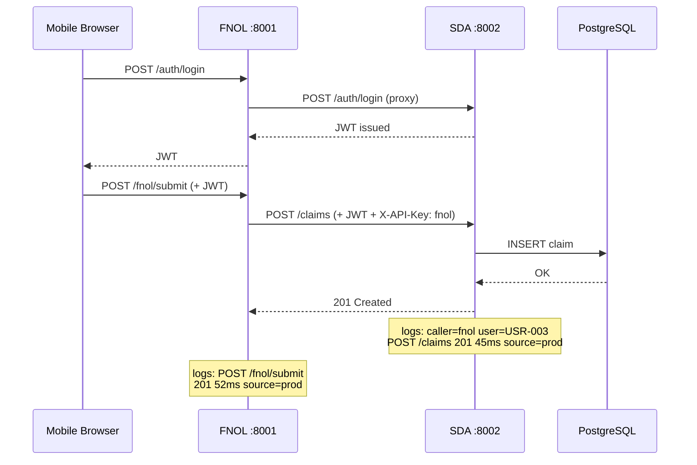

Both the FNOL log and the SDA log capture the same event from different perspectives. The dashboard can correlate them because the SDA line carries `caller=fnol` and both share the same timestamp window.

### Customer Portal (read-only)

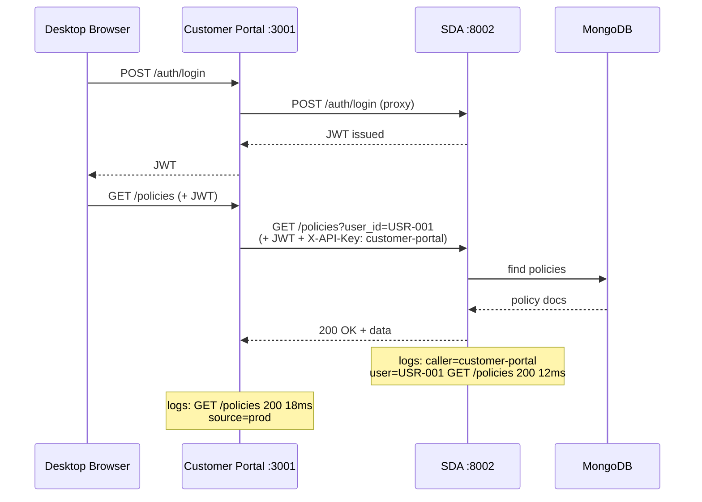

### Agent Portal (read-only)

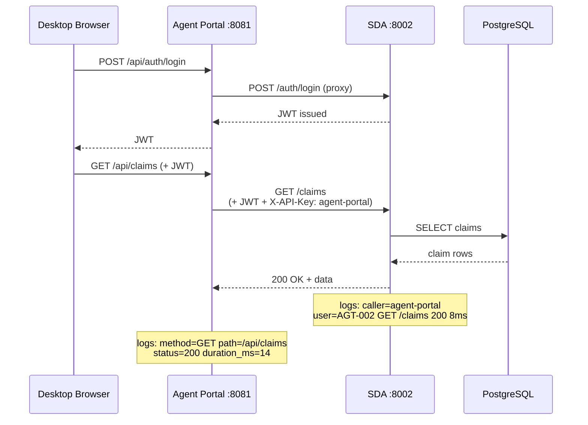

---

## The Background Simulator — Keeping Data Alive

With CP and AP read-only and FNOL only creating claims, statuses would never change. The SDA runs an in-process asyncio task that periodically advances claims through `submitted → triaged → investigating → settled → closed` (with a `denied` branch). Each transition records the assigned adjuster as the actor in `claim_status_history`.

The simulator writes Postgres in-process — it does NOT make an HTTP call against SDA's own routes. Each successful tick emits a `status_transition` domain event (INFO) shaped like:

```
event=status_transition caller=simulator user=ADJ-0042
claim_id=CLM-001 from_status=submitted to_status=triaged
```

No `method`, no `path`, no `status` code — these are domain events, not request logs. When CP or AP subsequently reads that claim, the status has changed — generating dynamic log activity downstream.

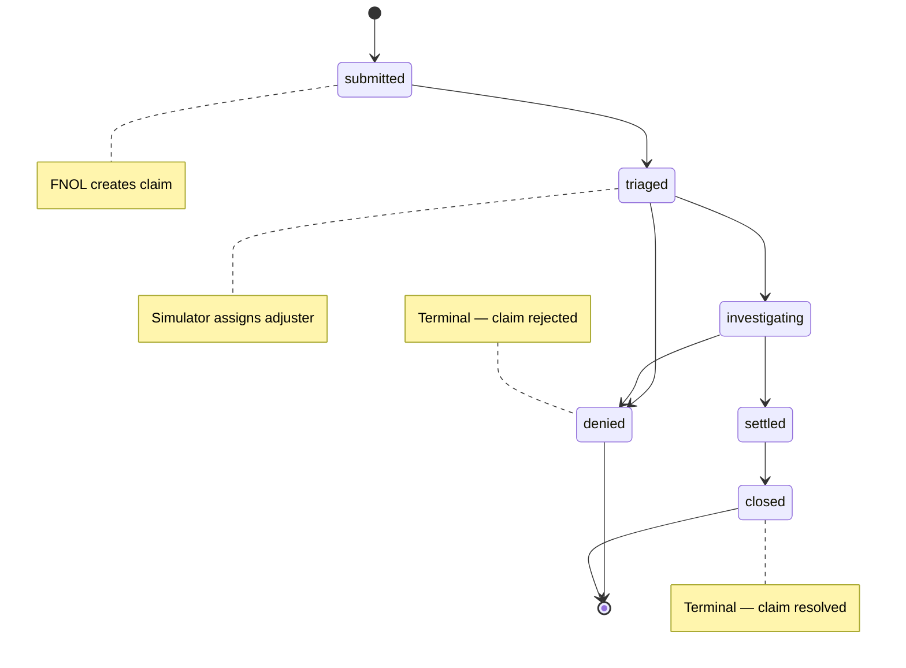

---

## Log Volumes — Four Independent Streams

Each app writes to its own Docker volume in its own native format:

| App | Volume | Format |
|---|---|---|
| SDA | `shared-data-api-logs` | structlog JSON — richest stream (`caller`, `user`, `source` on every line) |
| FNOL | `fnol-logs` | structlog JSON |
| CP | `customer-portal-logs` | Winston JSON |
| AP | `agent-portal-logs` | Logback text (multi-line stack traces) |

The dashboard mounts all four read-only at `/mnt/logs/<app>/`.

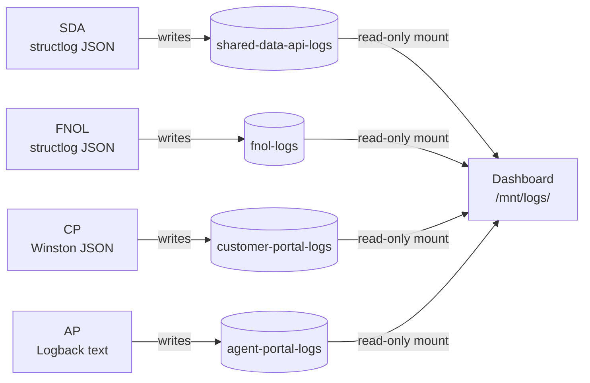

---

## X-Source — Tagging Every Request's Origin

Every app's request-logger middleware reads `X-Source` from the incoming HTTP header and emits `source=<value>` in the log line. **When absent, apps default to `source=unknown`** — real UX traffic from React SPAs explicitly tags `X-Source: prod` in the SPA's fetch wrapper, so the `unknown` default is the leak-detection signal (per the ADR-011 2026-06-07 amendment). Inter-service propagation (FNOL → SDA, CP → SDA, AP → SDA) uses native context carriers: Python `contextvars` for SDA/FNOL, Node `AsyncLocalStorage` for CP, Java SLF4J `MDC` for AP. So when the Agitator fires a synthetic request at FNOL, and FNOL calls SDA, the SDA log line also carries `source=synthetic` — the origin propagates through the call chain.

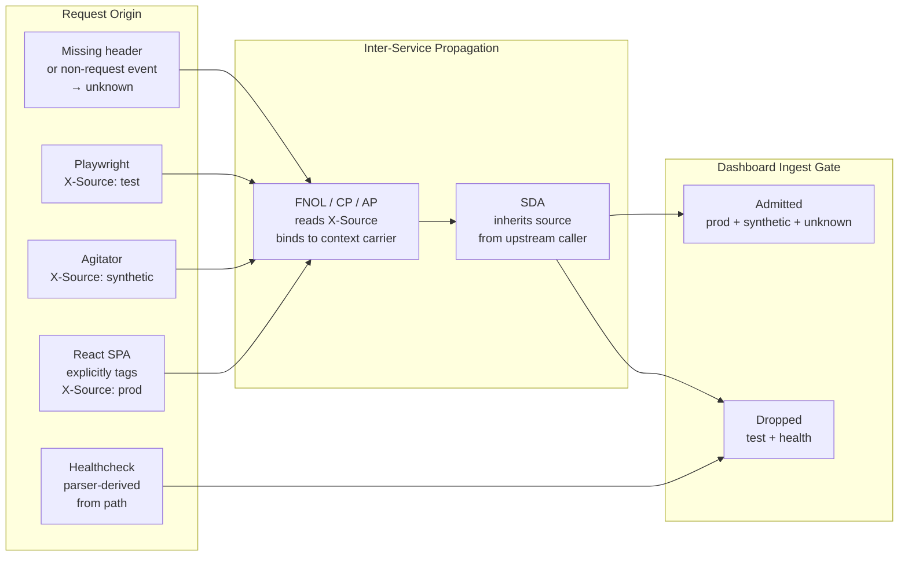

---

## Dashboard Log Ingestion Pipeline

```
Log volumes (4 files)
  → watchdog file watcher (detects new lines)
    → Parser (handles 3 formats: structlog JSON, Winston JSON, Logback text)
      → Ingest gate #1: DASHBOARD_INGEST_LEVELS (DEBUG, INFO, WARN, ERROR — Phase 8 / ADR-017 admits all levels; was WARN+ERROR Phase 7 cost-driven)
      → Ingest gate #2: DASHBOARD_INGEST_SOURCES (prod, synthetic, unknown by default)
        → drops test (Playwright), health (healthchecks) → signal-quality, not cost
      → Content-hash dedup (skip if already in Chroma)
        → Ollama nomic-embed-text embedding (local, free — Phase 8 / ADR-017)
          → Chroma upsert
            → embed-summary table printed to stdout (tokens + wall_ms; no USD)
```

The source gate drops Playwright `test` traffic and parser-derived `health` healthcheck pings for signal-quality reasons — Phase 8 / ADR-017 removed the cost-driven level gate so all levels enter Chroma, giving the agent baseline INFO data to anchor against. The `unknown` admission preserves leak-detection visibility — propagation gaps surface as `unknown`-tagged entries so the operator can spot drift.

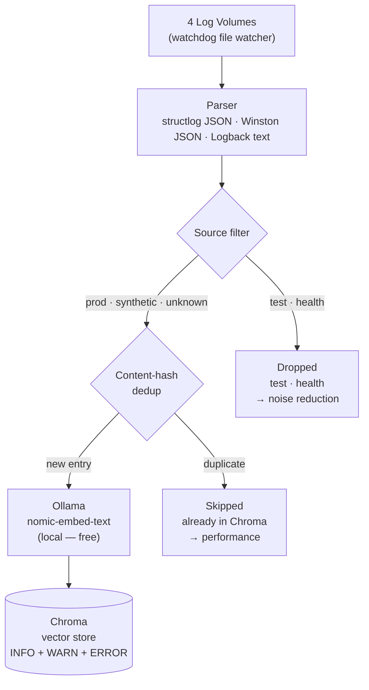

---

## Dashboard UI — Data Paths

**Path 1: Log Explorer + Overview** — reads the log volumes directly via `/api/logs`, `/api/status`, and `/api/status/history` (Overview trend sparklines). No Chroma, no LLM inference. Shows everything including INFO.

**Path 2: Semantic Search** — queries Chroma via `POST /api/logs/search`. One local Ollama embedding call per search query (Phase 8 / ADR-017). Returns entries ranked by semantic similarity — full corpus (INFO + WARN + ERROR), not just errors.

**Path 3: AI Chat + Error Detail** — invokes the LangGraph agent via `POST /api/chat` (with optional SSE streaming) or `GET /api/errors/{id}`. The agent uses its two tools (`query_logs` hits Chroma, `get_app_status` reads volumes) to gather context, then reasons via local Ollama `llama3.1:8b` LLM calls. Bounded by three caps: max tool calls per request (4), max input tokens (8000), dry-run optional (Phase 7 default `true` was cost-safety; Phase 8 default `false` since inference is free — see ADR-015 + ADR-017).

**Path 4: Vectorstore Stats + maintenance** — `GET /api/chroma/stats` powers the Vectorstore Stats screen (aggregate counts by app/level/source/event/day). `POST /api/chroma/flush` deletes every embedded doc on operator confirm. Both JWT-gated; no LLM inference.

**Path 5: Agitator (Log Generator)** — `/api/agitator/scenarios`, `/api/agitator/runs`, `/api/agitator/runs/{id}`, `/api/agitator/runs/{id}/cancel` back the `/log-generator` screen. In-memory run registry, ring-buffered to 50.

**Path 6: Proactive Scan loop (opt-in)** — background task that wakes every `DASHBOARD_PROACTIVE_SCAN_INTERVAL_SECONDS` (default 900) and invokes the same compiled agent graph as Chat. Findings ride on `/api/status` and surface inline on Overview. Requires BOTH `DASHBOARD_LLM_DRY_RUN=false` AND `DASHBOARD_PROACTIVE_SCAN_ENABLED=true`.

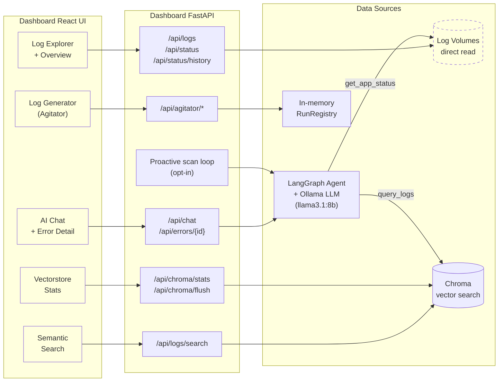

---

## The LangGraph Agent — 5-Node StateGraph

```
START → ingest → analyze → (tool_calls? → correlate → predict → analyze : → respond) → END
```

**ingest** — sanitizes user input, strips credentials, pins session ID. No LLM call.

**analyze** — first LLM call. The model decides: call `query_logs`/`get_app_status`, or answer directly.

**correlate** — executes tool calls, decrements tool budget. Produces `ToolMessage` results.

**predict** — second LLM call. Reflects on tool output. May request more tools (loops back to correlate) or finalize.

**respond** — terminal. Harvests cited log entries from tool results, builds the response.

The agent's session memory uses `InMemorySaver` keyed by `{jwt_sub}:{session_id}`. Restart clears history — the durable signal is in Chroma and the log volumes.

```mermaid
stateDiagram-v2
    [*] --> ingest
    ingest --> analyze

    state analyze_decision <<choice>>
    analyze --> analyze_decision
    analyze_decision --> correlate : tool_calls present
    analyze_decision --> respond : no tool_calls

    correlate --> predict
    
    state predict_decision <<choice>>
    predict --> predict_decision
    predict_decision --> correlate : more tool_calls\n(budget remaining)
    predict_decision --> respond : done or\nbudget exhausted

    respond --> [*]

    note right of ingest : Sanitize input\nstrip credentials\npin session ID\n(no LLM call)
    note right of analyze : 1st LLM call\ndecide: use tools\nor answer directly
    note left of correlate : Execute tool calls\nquery_logs → Chroma\nget_app_status → volumes\ndecrement budget
    note right of predict : 2nd LLM call\nreflect on tool output\nrequest more or finalize
    note left of respond : Harvest citations\nbuild response
```

---

## The Agitator — Operator-Driven Load Generation

Bundled into the dashboard at `/log-generator`. Ten bounded scenarios — one+ per monitored app:

| Scenario | Target | What Happens End-to-End | Needs chaos? |
|---|---|---|---|
| `auth-spike` | FNOL | N bad login attempts → FNOL logs `login_failed` WARN → FNOL calls SDA → SDA logs `sda_upstream_rejected` WARN → both hit Chroma | No |
| `payload-fuzz` | FNOL | Malformed claim submissions → FNOL logs `request_validation_error` WARN → Chroma | No |
| `policy-not-found` | FNOL | Reads against unknown policy numbers → FNOL logs `policy_not_found` WARN (domain event) + INFO request line → WARN admitted, INFO dropped → Chroma | No |
| `claim-burst` | FNOL | Valid claim submissions at high rate → FNOL + SDA log INFO `claim_created` → dropped by ingest gate (INFO) → zero Chroma cost, but Postgres gets new claims | No |
| `sda-degraded` | SDA | 240 reads with `X-Chaos: slow:500` over 120s → SDA chaos middleware sleeps 500ms → `chaos_honored` WARN at SDA → Chroma | **Yes** |
| `error-burst` | SDA | 120 reads with `X-Chaos: error:500` over 60s → SDA returns 500 → `chaos_honored` ERROR (5xx → ERROR per ADR-013 2026-06-06 amendment) → Chroma | **Yes** |
| `cp-read-burst` | CP | 100 GETs against CP `/policies/me` over 30s → INFO at CP + SDA → dropped (INFO) → zero Chroma cost | No |
| `cp-degraded` | CP | 80 GETs against CP `/policies/me` with `X-Chaos: slow:300` over 60s → CP `chaos_honored` WARN → Chroma | **Yes** |
| `ap-read-burst` | AP | 100 GETs against AP `/api/claims` over 30s → INFO at AP + SDA → dropped (INFO) → zero Chroma cost | No |
| `ap-degraded` | AP | 80 GETs against AP `/api/claims` with `X-Chaos: slow:300` over 60s → AP `chaos_honored` WARN → Chroma | **Yes** |

Every Agitator request goes through `build_client` which sets `X-Source: synthetic` as a default header. This propagates through the entire call chain — FNOL → SDA — so every resulting log line is tagged `source=synthetic` and admitted through the ingest gate.

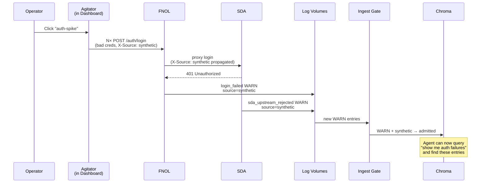

---

## Chaos Middleware — The Cascade Mechanism

`ENABLE_CHAOS=true` unlocks the chaos middleware on SDA / FNOL / CP / AP. The single-app scenarios (`sda-degraded`, `error-burst`, `cp-degraded`, `ap-degraded`) each target one app's middleware directly. The most interesting cross-app correlation pattern emerges when you fire **multiple chaos scenarios concurrently** (or hit several apps with `X-Chaos:` curls in the same time window): the LangGraph agent sees correlated WARN/ERROR entries clustered across SDA, CP, and AP, all tagged `source=synthetic`, all clustered in time.

For example, running `cp-degraded` and `ap-degraded` simultaneously produces:

```
Agitator → CP with X-Chaos: slow:300, X-Source: synthetic
  → CP chaos middleware sleeps 300ms
  → CP logs: chaos_honored WARN source=synthetic
  → CP proxies to SDA, which responds normally
  → CP logs: GET /policies/me slow upstream WARN (if duration_ms > threshold)

Agitator → AP with X-Chaos: slow:300, X-Source: synthetic
  → AP chaos middleware sleeps 300ms
  → AP logs: chaos_honored WARN source=synthetic
  → AP proxies to SDA, which responds normally
  → AP logs: GET /api/claims slow upstream WARN
```

The LangGraph agent, querying Chroma after this scenario combination runs, sees WARN entries from CP and AP clustered in the same time window, all tagged `source=synthetic`. The same pattern with `error-burst` produces ERROR-tier entries at SDA (per ADR-013 amendment) — the proactive scan loop picks those up and surfaces an anomaly card on Overview. That's the cross-app correlation the entire system was built to demonstrate.

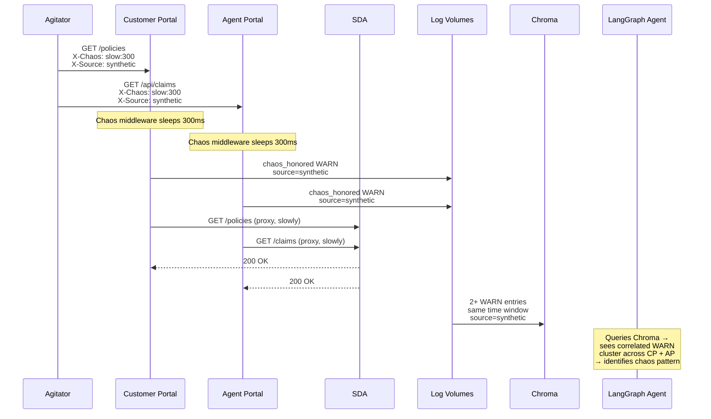

---

## The Full Circle

A single Agitator click produces a cascade that flows through every layer of the system: Dashboard → Agitator → FNOL/CP/AP → SDA → PostgreSQL/MongoDB → log volumes → watchdog → parser → ingest gate (source-only post-Phase-8) → local Ollama embeddings → Chroma → LangGraph agent → local Ollama LLM → React UI showing the root cause. Zero external API calls in the entire loop.

That's the integration story. Every component exists because the next component in the chain needs it.

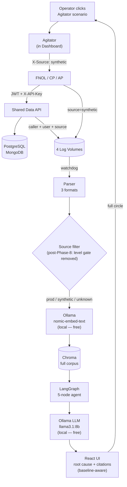
