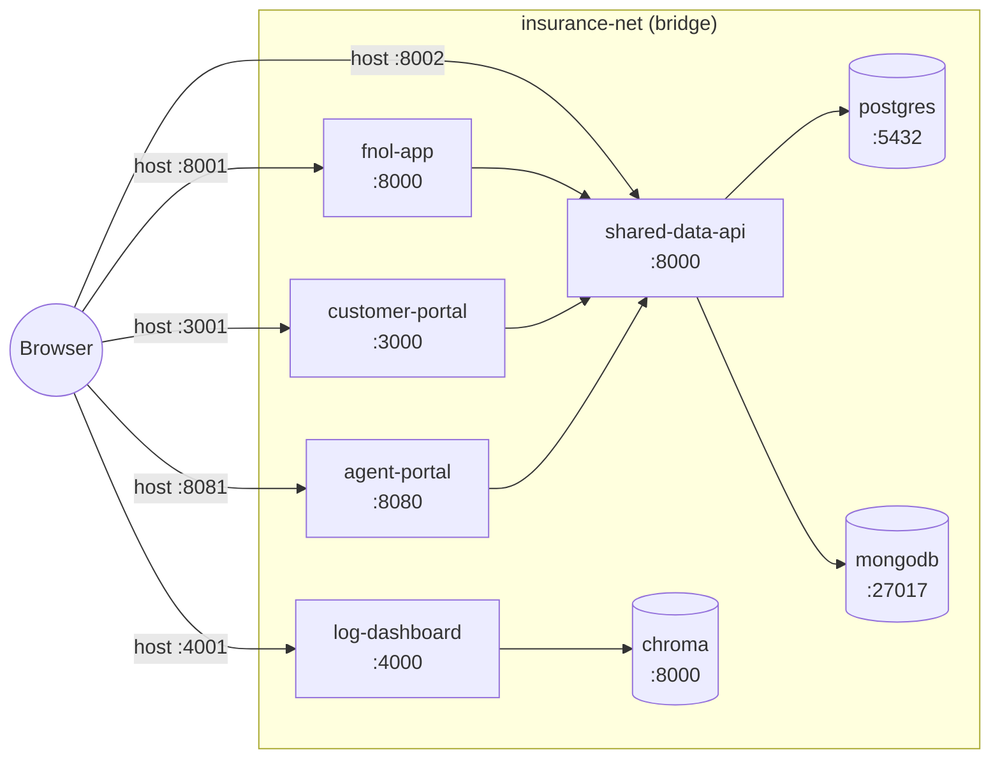
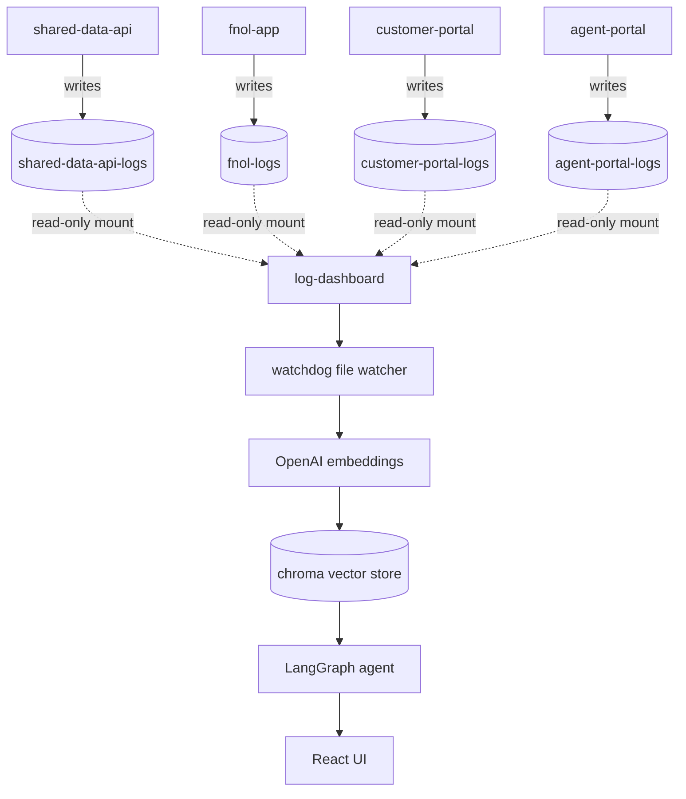

# System Overview

## Container Topology

All eight containers share the `insurance-net` bridge network. Browser traffic
enters via host ports; container-to-container traffic uses internal ports.

## Log Flow

All four logging apps write to their own named volumes. The dashboard mounts
every log volume **read-only**, watches them with `watchdog`, embeds new
entries into Chroma, and serves analysis through the LangGraph agent.

Shared Data API logs to both stdout and `/app/logs/shared-data-api.log` (volume
`shared-data-api-logs`), which the dashboard also mounts read-only. Every request
line includes `caller=<app>` and `user=<id>` attribution — see ADR-005 and
`docs/tech/logging-strategy.md`.

## Port Reference

| Container | Internal | Host |
|---|---|---|
| shared-data-api | 8000 | 8002 |
| fnol-app | 8000 | 8001 |
| customer-portal | 3000 | 3001 |
| agent-portal | 8080 | 8081 |
| log-dashboard | 4000 | 4001 |
| postgres | 5432 | 5433 |
| mongodb | 27017 | 27018 |
| chroma | 8000 | internal only |

## Startup Dependencies

`docker-compose.yml` wires these `depends_on` relationships so Compose starts services
in a valid order:

| Service | Waits for |
|---|---|
| shared-data-api | postgres (healthy), mongodb (healthy) |
| fnol-app | shared-data-api (healthy) |
| customer-portal | shared-data-api (healthy) |
| agent-portal | shared-data-api (healthy) |
| log-dashboard | chroma (healthy) |

> **Post-Phase-6 state:** every `depends_on` above uses `condition: service_healthy`.
> The app-tier dependencies were upgraded as each phase landed a real server with a
> healthcheck (Phase 3 SDA → postgres/mongodb, Phases 4–6 FNOL/CP/AP → SDA). The
> `log-dashboard → chroma` link has used `service_healthy` since Phase 2.
